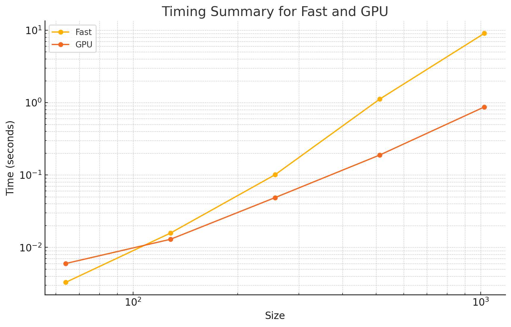

# MiniTorch Module 3


* Docs: https://minitorch.github.io/

* Overview: https://minitorch.github.io/module3.html


You will need to modify `tensor_functions.py` slightly in this assignment.

* Tests:

```
python run_tests.py
```

* Note:

Several of the tests for this assignment will only run if you are on a GPU machine and will not
run on github's test infrastructure. Please follow the instructions to setup up a colab machine
to run these tests.

This assignment requires the following files from the previous assignments. You can get these by running

```bash
python sync_previous_module.py previous-module-dir current-module-dir
```

The files that will be synced are:

        minitorch/tensor_data.py minitorch/tensor_functions.py minitorch/tensor_ops.py minitorch/operators.py minitorch/scalar.py minitorch/scalar_functions.py minitorch/module.py minitorch/autodiff.py minitorch/module.py project/run_manual.py project/run_scalar.py project/run_tensor.py minitorch/operators.py minitorch/module.py minitorch/autodiff.py minitorch/tensor.py minitorch/datasets.py minitorch/testing.py minitorch/optim.py


# Task 3.4

Fast ops vs GPU ops



```Timing summary
Size: 64
    fast: 0.00329
    gpu: 0.00599
Size: 128
    fast: 0.01575
    gpu: 0.01293
Size: 256
    fast: 0.10087
    gpu: 0.04873
Size: 512
    fast: 1.11760
    gpu: 0.18876
Size: 1024
    fast: 9.06136
    gpu: 0.87195
```

# Task 3.5

## Split dataset (CPU)

My CPU code is much faster than GPU.

```Epoch  0  loss  6.545254595798193 correct 35 | avgtime 16.554
Epoch  10  loss  5.882552831366212 correct 41 | avgtime 1.602
Epoch  20  loss  5.0088863746953525 correct 42 | avgtime 0.890
Epoch  30  loss  4.0711962325745565 correct 47 | avgtime 0.637
Epoch  40  loss  5.508395816836496 correct 45 | avgtime 0.508
Epoch  50  loss  3.4344649768280497 correct 48 | avgtime 0.431
Epoch  60  loss  3.3256651689566255 correct 48 | avgtime 0.386
Epoch  70  loss  2.7976682240061947 correct 46 | avgtime 0.358
Epoch  80  loss  1.5683983399284787 correct 46 | avgtime 0.327
Epoch  90  loss  2.4670973241196505 correct 48 | avgtime 0.303
Epoch  100  loss  3.3420234745751314 correct 47 | avgtime 0.283
Epoch  110  loss  0.913715197223898 correct 46 | avgtime 0.268
Epoch  120  loss  1.0045090195654032 correct 48 | avgtime 0.254
Epoch  130  loss  1.9710111966024602 correct 48 | avgtime 0.244
Epoch  140  loss  3.609493947608123 correct 46 | avgtime 0.234
Epoch  150  loss  4.823268815649602 correct 42 | avgtime 0.226
Epoch  160  loss  1.7254942459388565 correct 49 | avgtime 0.219
Epoch  170  loss  1.2560372974715999 correct 48 | avgtime 0.217
Epoch  180  loss  2.018574390962187 correct 49 | avgtime 0.213
Epoch  190  loss  3.3214933566231664 correct 48 | avgtime 0.207
Epoch  200  loss  1.5085674380147893 correct 47 | avgtime 0.202
Epoch  210  loss  0.9109054588775083 correct 48 | avgtime 0.198
Epoch  220  loss  0.7720028749682564 correct 49 | avgtime 0.194
Epoch  230  loss  1.9145758219981495 correct 49 | avgtime 0.190
Epoch  240  loss  0.9277635751483944 correct 47 | avgtime 0.187
Epoch  250  loss  2.097164626427681 correct 46 | avgtime 0.184
Epoch  260  loss  1.090116463425204 correct 48 | avgtime 0.181
Epoch  270  loss  2.6417012504470097 correct 45 | avgtime 0.181
Epoch  280  loss  0.786678925851568 correct 49 | avgtime 0.180
Epoch  290  loss  1.15022524108246 correct 49 | avgtime 0.177
Epoch  300  loss  0.835947322650515 correct 49 | avgtime 0.175
Epoch  310  loss  0.45595895331710967 correct 46 | avgtime 0.173
Epoch  320  loss  1.2239548780446619 correct 49 | avgtime 0.171
Epoch  330  loss  1.2934602387150584 correct 48 | avgtime 0.169
Epoch  340  loss  1.039486159042603 correct 48 | avgtime 0.167
Epoch  350  loss  1.304452569172477 correct 49 | avgtime 0.166
Epoch  360  loss  0.5022865098005084 correct 49 | avgtime 0.164
Epoch  370  loss  3.2263505671907806 correct 50 | avgtime 0.163
Epoch  380  loss  3.042644068760375 correct 47 | avgtime 0.164
Epoch  390  loss  0.8808871930509193 correct 48 | avgtime 0.163
Epoch  400  loss  0.33436994378541063 correct 49 | avgtime 0.161
Epoch  410  loss  1.9722509586447228 correct 49 | avgtime 0.160
Epoch  420  loss  3.0897019860232944 correct 50 | avgtime 0.159
Epoch  430  loss  3.7557912186547413 correct 43 | avgtime 0.158
Epoch  440  loss  0.8956850740109825 correct 49 | avgtime 0.156
Epoch  450  loss  1.1257784172737209 correct 50 | avgtime 0.155
Epoch  460  loss  0.5749561598007561 correct 49 | avgtime 0.154
Epoch  470  loss  0.522239760234002 correct 49 | avgtime 0.153
Epoch  480  loss  3.9949355923018586 correct 45 | avgtime 0.154
Epoch  490  loss  0.8720198059337276 correct 46 | avgtime 0.154
```


## Split dataset (GPU)
```
Epoch  0  loss  7.464073762413637 correct 36 | avgtime 4.068
Epoch  10  loss  5.536555825528271 correct 43 | avgtime 1.865
Epoch  20  loss  4.774814833569234 correct 47 | avgtime 1.787
Epoch  30  loss  3.8176758058738 correct 44 | avgtime 1.719
Epoch  40  loss  2.9218034894494864 correct 46 | avgtime 1.686
Epoch  50  loss  2.475222529670729 correct 49 | avgtime 1.677
Epoch  60  loss  3.245775696642008 correct 46 | avgtime 1.661
Epoch  70  loss  1.6787209530132712 correct 46 | avgtime 1.648
Epoch  80  loss  2.276273825738415 correct 47 | avgtime 1.648
Epoch  90  loss  1.0007776050356716 correct 48 | avgtime 1.641
Epoch  100  loss  1.6410498466692882 correct 48 | avgtime 1.634
Epoch  110  loss  0.9508725542146957 correct 49 | avgtime 1.632
Epoch  120  loss  0.5797632004892914 correct 49 | avgtime 1.629
Epoch  130  loss  1.5882832943870908 correct 49 | avgtime 1.626
Epoch  140  loss  0.8321662589123356 correct 49 | avgtime 1.622
Epoch  150  loss  1.368811896760549 correct 49 | avgtime 1.629
Epoch  160  loss  1.400348545784629 correct 50 | avgtime 1.625
Epoch  170  loss  2.588119824015272 correct 49 | avgtime 1.622
Epoch  180  loss  1.1637917898002055 correct 49 | avgtime 1.623
Epoch  190  loss  0.7531781036566642 correct 49 | avgtime 1.621
Epoch  200  loss  1.4269170157060298 correct 49 | avgtime 1.618
Epoch  210  loss  0.6253528259471341 correct 49 | avgtime 1.617
Epoch  220  loss  2.132025693356082 correct 48 | avgtime 1.617
Epoch  230  loss  0.5295008517777808 correct 50 | avgtime 1.614
Epoch  240  loss  0.7495446833219394 correct 49 | avgtime 1.612
Epoch  250  loss  0.5772737508157826 correct 49 | avgtime 1.613
Epoch  260  loss  0.3232378682476648 correct 49 | avgtime 1.612
Epoch  270  loss  1.9320733232214835 correct 49 | avgtime 1.610
Epoch  280  loss  0.4368446426728211 correct 50 | avgtime 1.614
Epoch  290  loss  2.1570271089545066 correct 49 | avgtime 1.613
Epoch  300  loss  1.217703041063809 correct 49 | avgtime 1.611
Epoch  310  loss  0.10507894503625358 correct 50 | avgtime 1.610
Epoch  320  loss  0.41581565072377646 correct 50 | avgtime 1.610
Epoch  330  loss  0.15122259431158358 correct 49 | avgtime 1.609
Epoch  340  loss  0.7119654758750691 correct 49 | avgtime 1.608
Epoch  350  loss  0.05698788457019405 correct 49 | avgtime 1.609
Epoch  360  loss  0.32745715360620054 correct 49 | avgtime 1.607
Epoch  370  loss  0.2726870050517636 correct 49 | avgtime 1.606
Epoch  380  loss  0.4501957616896136 correct 50 | avgtime 1.606
Epoch  390  loss  0.14714890522417204 correct 49 | avgtime 1.606
Epoch  400  loss  0.7234296888670858 correct 49 | avgtime 1.605
Epoch  410  loss  0.3594594629588038 correct 48 | avgtime 1.606
Epoch  420  loss  1.3954968352491783 correct 49 | avgtime 1.607
Epoch  430  loss  1.1948079665303868 correct 49 | avgtime 1.606
Epoch  440  loss  1.1415222506845761 correct 49 | avgtime 1.605
Epoch  450  loss  0.30690778494167087 correct 49 | avgtime 1.606
Epoch  460  loss  0.18615760295839998 correct 49 | avgtime 1.605
Epoch  470  loss  1.330428429328573 correct 49 | avgtime 1.605
Epoch  480  loss  1.0865034255977042 correct 49 | avgtime 1.604
Epoch  490  loss  1.295505819559996 correct 49 | avgtime 1.605
```

## Simple dataset (GPU)

```
Epoch  0  loss  5.443152402549857 correct 49 | avgtime 4.136
Epoch  10  loss  1.362509856805473 correct 50 | avgtime 1.884
Epoch  20  loss  1.230783618205664 correct 50 | avgtime 1.777
Epoch  30  loss  0.9786561717632289 correct 50 | avgtime 1.711
Epoch  40  loss  0.24171570865680014 correct 50 | avgtime 1.681
Epoch  50  loss  0.13280821426788675 correct 50 | avgtime 1.670
Epoch  60  loss  0.4850681823468297 correct 50 | avgtime 1.660
Epoch  70  loss  0.4647256312412093 correct 50 | avgtime 1.648
Epoch  80  loss  0.6314067364437239 correct 50 | avgtime 1.641
Epoch  90  loss  0.35325506906726845 correct 50 | avgtime 1.643
Epoch  100  loss  0.4688140731806098 correct 50 | avgtime 1.636
Epoch  110  loss  0.033230466606669166 correct 50 | avgtime 1.631
Epoch  120  loss  0.3318980503224886 correct 50 | avgtime 1.633
Epoch  130  loss  0.2356335214560356 correct 50 | avgtime 1.630
Epoch  140  loss  0.09072046819014844 correct 50 | avgtime 1.634
Epoch  150  loss  0.07446365924740736 correct 50 | avgtime 1.632
Epoch  160  loss  0.06043119530168889 correct 50 | avgtime 1.633
Epoch  170  loss  0.063934244831786 correct 50 | avgtime 1.632
Epoch  180  loss  0.20359410125772634 correct 50 | avgtime 1.629
Epoch  190  loss  0.30580765599082577 correct 50 | avgtime 1.631
Epoch  200  loss  0.0036661665378166642 correct 50 | avgtime 1.628
Epoch  210  loss  0.08531527426759118 correct 50 | avgtime 1.626
Epoch  220  loss  0.11563088866105603 correct 50 | avgtime 1.628
Epoch  230  loss  0.01598660335296549 correct 50 | avgtime 1.626
Epoch  240  loss  0.2699751794326183 correct 50 | avgtime 1.624
Epoch  250  loss  0.08044758128991857 correct 50 | avgtime 1.625
Epoch  260  loss  0.025360928755404064 correct 50 | avgtime 1.624
Epoch  270  loss  0.01980970624712966 correct 50 | avgtime 1.626
Epoch  280  loss  0.11580469068627068 correct 50 | avgtime 1.627
Epoch  290  loss  0.24503754663182317 correct 50 | avgtime 1.626
Epoch  300  loss  0.2851826068062068 correct 50 | avgtime 1.624
Epoch  310  loss  0.1997535836553485 correct 50 | avgtime 1.623
Epoch  320  loss  0.018274656522483522 correct 50 | avgtime 1.624
Epoch  330  loss  0.18898991909923724 correct 50 | avgtime 1.623
Epoch  340  loss  0.2706549621592708 correct 50 | avgtime 1.622
Epoch  350  loss  0.016709096814364752 correct 50 | avgtime 1.623
Epoch  360  loss  0.006224351813580744 correct 50 | avgtime 1.622
Epoch  370  loss  0.03952241778416767 correct 50 | avgtime 1.621
Epoch  380  loss  0.006793963436134359 correct 50 | avgtime 1.622
Epoch  390  loss  0.046076467493583566 correct 50 | avgtime 1.623
Epoch  400  loss  0.1488248743689264 correct 50 | avgtime 1.622
Epoch  410  loss  0.08687824225774922 correct 50 | avgtime 1.621
Epoch  420  loss  0.004428190648654537 correct 50 | avgtime 1.622
Epoch  430  loss  0.006950856689833793 correct 50 | avgtime 1.621
Epoch  440  loss  0.13227244861692447 correct 50 | avgtime 1.621
Epoch  450  loss  0.006856006961362186 correct 50 | avgtime 1.621
Epoch  460  loss  0.009799601342439426 correct 50 | avgtime 1.620
Epoch  470  loss  0.04554688124568557 correct 50 | avgtime 1.619
Epoch  480  loss  0.005991449530648988 correct 50 | avgtime 1.618
Epoch  490  loss  0.1263818121197431 correct 50 | avgtime 1.619
```

## Xor dataset (GPU)

```Epoch  0  loss  6.088299310193985 correct 29 | avgtime 4.969
Epoch  10  loss  4.3809350980628015 correct 35 | avgtime 1.879
Epoch  20  loss  5.17145376512497 correct 46 | avgtime 1.730
Epoch  30  loss  2.965097299706035 correct 45 | avgtime 1.685
Epoch  40  loss  3.20889857750592 correct 41 | avgtime 1.665
Epoch  50  loss  4.532611328941268 correct 41 | avgtime 1.643
Epoch  60  loss  3.3618053177864167 correct 44 | avgtime 1.628
Epoch  70  loss  2.63212815299395 correct 47 | avgtime 1.628
Epoch  80  loss  0.9388163835169582 correct 47 | avgtime 1.620
Epoch  90  loss  1.850263677203321 correct 49 | avgtime 1.613
Epoch  100  loss  2.2141764992814013 correct 49 | avgtime 1.619
Epoch  110  loss  2.4325142170804663 correct 48 | avgtime 1.616
Epoch  120  loss  1.936865469553172 correct 49 | avgtime 1.610
Epoch  130  loss  1.0499679421586698 correct 49 | avgtime 1.607
Epoch  140  loss  1.9076173199658866 correct 49 | avgtime 1.609
Epoch  150  loss  0.4673282691508594 correct 49 | avgtime 1.605
Epoch  160  loss  1.8535147761845034 correct 49 | avgtime 1.603
Epoch  170  loss  0.2817266913943332 correct 49 | avgtime 1.601
Epoch  180  loss  0.49080953044900744 correct 49 | avgtime 1.603
Epoch  190  loss  1.3020154318703567 correct 49 | avgtime 1.601
Epoch  200  loss  0.8005478600750006 correct 50 | avgtime 1.600
Epoch  210  loss  0.30508992787988526 correct 50 | avgtime 1.602
Epoch  220  loss  0.34691830834000764 correct 49 | avgtime 1.601
Epoch  230  loss  0.47880834394732263 correct 50 | avgtime 1.603
Epoch  240  loss  0.20933997690432748 correct 50 | avgtime 1.602
Epoch  250  loss  0.495208097253841 correct 49 | avgtime 1.603
Epoch  260  loss  0.08190826760752308 correct 50 | avgtime 1.601
Epoch  270  loss  1.4068062461525832 correct 49 | avgtime 1.599
Epoch  280  loss  0.374315737241258 correct 50 | avgtime 1.601
Epoch  290  loss  0.11340117900378902 correct 50 | avgtime 1.599
Epoch  300  loss  0.20377438800824033 correct 50 | avgtime 1.598
Epoch  310  loss  0.3821998229333005 correct 50 | avgtime 1.596
Epoch  320  loss  0.061388792867755004 correct 50 | avgtime 1.598
Epoch  330  loss  0.6679719219437475 correct 50 | avgtime 1.596
Epoch  340  loss  0.2118441871790746 correct 50 | avgtime 1.595
Epoch  350  loss  0.19982032892682638 correct 50 | avgtime 1.595
Epoch  360  loss  0.1683610277272761 correct 50 | avgtime 1.597
Epoch  370  loss  0.15802153377736786 correct 50 | avgtime 1.596
Epoch  380  loss  0.21693397334217876 correct 50 | avgtime 1.595
Epoch  390  loss  0.6993237754754124 correct 50 | avgtime 1.596
Epoch  400  loss  0.09515500635364585 correct 50 | avgtime 1.595
Epoch  410  loss  0.10371957287296964 correct 50 | avgtime 1.594
Epoch  420  loss  0.29512113027386244 correct 50 | avgtime 1.594
Epoch  430  loss  0.013235324708882602 correct 50 | avgtime 1.594
Epoch  440  loss  0.024476933279708894 correct 50 | avgtime 1.593
Epoch  450  loss  0.553287012565514 correct 50 | avgtime 1.592
Epoch  460  loss  0.07713302514850427 correct 50 | avgtime 1.592
Epoch  470  loss  0.35864818516357133 correct 50 | avgtime 1.591
Epoch  480  loss  0.2449540860719204 correct 50 | avgtime 1.591
Epoch  490  loss  0.13320180314683577 correct 50 | avgtime 1.593
```

# Task 3.1 Parallelization

```================================================================================
 Parallel Accelerator Optimizing:  Function tensor_map.<locals>._map,
/Users/benjamin/Library/Python/3.9/lib/python/site-
packages/minitorch/fast_ops.py (164)
================================================================================


Parallel loop listing for  Function tensor_map.<locals>._map, /Users/benjamin/Library/Python/3.9/lib/python/site-packages/minitorch/fast_ops.py (164)
-------------------------------------------------------------------------|loop #ID
    def _map(                                                            |
        out: Storage,                                                    |
        out_shape: Shape,                                                |
        out_strides: Strides,                                            |
        in_storage: Storage,                                             |
        in_shape: Shape,                                                 |
        in_strides: Strides,                                             |
    ) -> None:                                                           |
        # Implemented for Task 3.1                                       |
                                                                         |
        if np.array_equal(in_shape, out_shape) and np.array_equal(       |
            in_strides, out_strides                                      |
        ):                                                               |
            for i in prange(len(out)):-----------------------------------| #0
                out[i] = fn(in_storage[i])                               |
            return                                                       |
                                                                         |
        for i in prange(len(out)):---------------------------------------| #1
            in_index = np.empty(MAX_DIMS, dtype=np.int32)                |
            out_index = np.empty(MAX_DIMS, dtype=np.int32)               |
                                                                         |
            to_index(i, out_shape, out_index)                            |
                                                                         |
            broadcast_index(out_index, out_shape, in_shape, in_index)    |
                                                                         |
            in_ordinal = index_to_position(in_index, in_strides)         |
            out_ordinal = index_to_position(out_index, out_strides)      |
            out[out_ordinal] = fn(in_storage[in_ordinal])                |
--------------------------------- Fusing loops ---------------------------------
Attempting fusion of parallel loops (combines loops with similar properties)...
Following the attempted fusion of parallel for-loops there are 2 parallel for-
loop(s) (originating from loops labelled: #0, #1).
--------------------------------------------------------------------------------
----------------------------- Before Optimisation ------------------------------
--------------------------------------------------------------------------------
------------------------------ After Optimisation ------------------------------
Parallel structure is already optimal.
--------------------------------------------------------------------------------
--------------------------------------------------------------------------------

---------------------------Loop invariant code motion---------------------------
Allocation hoisting:
The memory allocation derived from the instruction at
/Users/benjamin/Library/Python/3.9/lib/python/site-
packages/minitorch/fast_ops.py (182) is hoisted out of the parallel loop
labelled #1 (it will be performed before the loop is executed and reused inside
the loop):
   Allocation:: in_index = np.empty(MAX_DIMS, dtype=np.int32)
    - numpy.empty() is used for the allocation.
The memory allocation derived from the instruction at
/Users/benjamin/Library/Python/3.9/lib/python/site-
packages/minitorch/fast_ops.py (183) is hoisted out of the parallel loop
labelled #1 (it will be performed before the loop is executed and reused inside
the loop):
   Allocation:: out_index = np.empty(MAX_DIMS, dtype=np.int32)
    - numpy.empty() is used for the allocation.
None
ZIP
[10] [10] [10]

================================================================================
 Parallel Accelerator Optimizing:  Function tensor_zip.<locals>._zip,
/Users/benjamin/Library/Python/3.9/lib/python/site-
packages/minitorch/fast_ops.py (219)
================================================================================


Parallel loop listing for  Function tensor_zip.<locals>._zip, /Users/benjamin/Library/Python/3.9/lib/python/site-packages/minitorch/fast_ops.py (219)
---------------------------------------------------------------------------------|loop #ID
    def _zip(                                                                    |
        out: Storage,                                                            |
        out_shape: Shape,                                                        |
        out_strides: Strides,                                                    |
        a_storage: Storage,                                                      |
        a_shape: Shape,                                                          |
        a_strides: Strides,                                                      |
        b_storage: Storage,                                                      |
        b_shape: Shape,                                                          |
        b_strides: Strides,                                                      |
    ) -> None:                                                                   |
        if (                                                                     |
            np.array_equal(a_shape, b_shape)                                     |
            and np.array_equal(a_shape, out_shape)                               |
            and np.array_equal(a_strides, b_strides)                             |
            and np.array_equal(a_strides, out_strides)                           |
        ):                                                                       |
            print(out_shape, a_shape, b_shape)                                   |
            for i in prange(len(out)):-------------------------------------------| #2
                out[i] = fn(a_storage[i], b_storage[i])                          |
            return                                                               |
                                                                                 |
        for i in prange(len(out)):-----------------------------------------------| #3
            out_index: Index = np.empty(MAX_DIMS, dtype=np.int32)                |
            a_index: Index = np.empty(MAX_DIMS, dtype=np.int32)                  |
            b_index: Index = np.empty(MAX_DIMS, dtype=np.int32)                  |
                                                                                 |
            # iterate over all possible out_indices                              |
            to_index(i, out_shape, out_index)                                    |
                                                                                 |
            # get corresponding indices for a and b                              |
            broadcast_index(out_index, out_shape, a_shape, a_index)              |
            broadcast_index(out_index, out_shape, b_shape, b_index)              |
                                                                                 |
            a_ordinal = index_to_position(a_index, a_strides)                    |
            b_ordinal = index_to_position(b_index, b_strides)                    |
            out_ordinal = index_to_position(out_index, out_strides)              |
            out[out_ordinal] = fn(a_storage[a_ordinal], b_storage[b_ordinal])    |
--------------------------------- Fusing loops ---------------------------------
Attempting fusion of parallel loops (combines loops with similar properties)...
Following the attempted fusion of parallel for-loops there are 2 parallel for-
loop(s) (originating from loops labelled: #2, #3).
--------------------------------------------------------------------------------
----------------------------- Before Optimisation ------------------------------
--------------------------------------------------------------------------------
------------------------------ After Optimisation ------------------------------
Parallel structure is already optimal.
--------------------------------------------------------------------------------
--------------------------------------------------------------------------------

---------------------------Loop invariant code motion---------------------------
Allocation hoisting:
The memory allocation derived from the instruction at
/Users/benjamin/Library/Python/3.9/lib/python/site-
packages/minitorch/fast_ops.py (242) is hoisted out of the parallel loop
labelled #3 (it will be performed before the loop is executed and reused inside
the loop):
   Allocation:: out_index: Index = np.empty(MAX_DIMS, dtype=np.int32)
    - numpy.empty() is used for the allocation.
The memory allocation derived from the instruction at
/Users/benjamin/Library/Python/3.9/lib/python/site-
packages/minitorch/fast_ops.py (243) is hoisted out of the parallel loop
labelled #3 (it will be performed before the loop is executed and reused inside
the loop):
   Allocation:: a_index: Index = np.empty(MAX_DIMS, dtype=np.int32)
    - numpy.empty() is used for the allocation.
The memory allocation derived from the instruction at
/Users/benjamin/Library/Python/3.9/lib/python/site-
packages/minitorch/fast_ops.py (244) is hoisted out of the parallel loop
labelled #3 (it will be performed before the loop is executed and reused inside
the loop):
   Allocation:: b_index: Index = np.empty(MAX_DIMS, dtype=np.int32)
    - numpy.empty() is used for the allocation.
None
REDUCE

================================================================================
 Parallel Accelerator Optimizing:  Function tensor_reduce.<locals>._reduce,
/Users/benjamin/Library/Python/3.9/lib/python/site-
packages/minitorch/fast_ops.py (282)
================================================================================


Parallel loop listing for  Function tensor_reduce.<locals>._reduce, /Users/benjamin/Library/Python/3.9/lib/python/site-packages/minitorch/fast_ops.py (282)
------------------------------------------------------------------------|loop #ID
    def _reduce(                                                        |
        out: Storage,                                                   |
        out_shape: Shape,                                               |
        out_strides: Strides,                                           |
        a_storage: Storage,                                             |
        a_shape: Shape,                                                 |
        a_strides: Strides,                                             |
        reduce_dim: int,                                                |
    ) -> None:                                                          |
        # Loop over everything (inefficient for now)                    |
        reduce_size = a_shape[reduce_dim]                               |
                                                                        |
        for i in prange(len(out)):--------------------------------------| #4
            out_index: Index = np.empty(MAX_DIMS, dtype=np.int32)       |
            # iterate over all possible out_indices                     |
            to_index(i, out_shape, out_index)                           |
                                                                        |
            # get corresponding set of indices for a                    |
            out_ordinal = index_to_position(out_index, out_strides)     |
            a_ordinal: int = index_to_position(out_index, a_strides)    |
            val = a_storage[a_ordinal]                                  |
                                                                        |
            for _ in range(1, reduce_size):                             |
                a_ordinal += a_strides[reduce_dim]                      |
                val = fn(val, a_storage[a_ordinal])                     |
                                                                        |
            out[out_ordinal] = val                                      |
--------------------------------- Fusing loops ---------------------------------
Attempting fusion of parallel loops (combines loops with similar properties)...
Following the attempted fusion of parallel for-loops there are 1 parallel for-
loop(s) (originating from loops labelled: #4).
--------------------------------------------------------------------------------
----------------------------- Before Optimisation ------------------------------
--------------------------------------------------------------------------------
------------------------------ After Optimisation ------------------------------
Parallel structure is already optimal.
--------------------------------------------------------------------------------
--------------------------------------------------------------------------------

---------------------------Loop invariant code motion---------------------------
Allocation hoisting:
The memory allocation derived from the instruction at
/Users/benjamin/Library/Python/3.9/lib/python/site-
packages/minitorch/fast_ops.py (295) is hoisted out of the parallel loop
labelled #4 (it will be performed before the loop is executed and reused inside
the loop):
   Allocation:: out_index: Index = np.empty(MAX_DIMS, dtype=np.int32)
    - numpy.empty() is used for the allocation.
None
MATRIX MULTIPLY

================================================================================
 Parallel Accelerator Optimizing:  Function _tensor_matrix_multiply,
/Users/benjamin/Library/Python/3.9/lib/python/site-
packages/minitorch/fast_ops.py (313)
================================================================================


Parallel loop listing for  Function _tensor_matrix_multiply, /Users/benjamin/Library/Python/3.9/lib/python/site-packages/minitorch/fast_ops.py (313)
-------------------------------------------------------------------------------------------------|loop #ID
def _tensor_matrix_multiply(                                                                     |
    out: Storage,                                                                                |
    out_shape: Shape,                                                                            |
    out_strides: Strides,                                                                        |
    a_storage: Storage,                                                                          |
    a_shape: Shape,                                                                              |
    a_strides: Strides,                                                                          |
    b_storage: Storage,                                                                          |
    b_shape: Shape,                                                                              |
    b_strides: Strides,                                                                          |
) -> None:                                                                                       |
    """NUMBA tensor matrix multiply function.                                                    |
                                                                                                 |
    Should work for any tensor shapes that broadcast as long as                                  |
                                                                                                 |
    ```                                                                                          |
    assert a_shape[-1] == b_shape[-2]                                                            |
    ```                                                                                          |
                                                                                                 |
    Optimizations:                                                                               |
                                                                                                 |
    * Outer loop in parallel                                                                     |
    * No index buffers or function calls                                                         |
    * Inner loop should have no global writes, 1 multiply.                                       |
                                                                                                 |
                                                                                                 |
    Args:                                                                                        |
    ----                                                                                         |
        out (Storage): storage for `out` tensor                                                  |
        out_shape (Shape): shape for `out` tensor                                                |
        out_strides (Strides): strides for `out` tensor                                          |
        a_storage (Storage): storage for `a` tensor                                              |
        a_shape (Shape): shape for `a` tensor                                                    |
        a_strides (Strides): strides for `a` tensor                                              |
        b_storage (Storage): storage for `b` tensor                                              |
        b_shape (Shape): shape for `b` tensor                                                    |
        b_strides (Strides): strides for `b` tensor                                              |
                                                                                                 |
    Returns:                                                                                     |
    -------                                                                                      |
        None : Fills in `out`                                                                    |
                                                                                                 |
    """                                                                                          |
    # Assume we only need to support 3 dimensions                                                |
    a_batch_stride = a_strides[0] if a_shape[0] > 1 else 0                                       |
    b_batch_stride = b_strides[0] if b_shape[0] > 1 else 0                                       |
                                                                                                 |
    # Implement for Task 3.2.                                                                    |
    for k in prange(len(out)):-------------------------------------------------------------------| #5
        # assume out_strides has length 3, as does out_shape                                     |
        # batch dimension                                                                        |
        n = k // out_strides[0]                                                                  |
        # i is which row to sum over                                                             |
        i = (k % out_strides[0]) // out_strides[1]                                               |
        # j is which column                                                                      |
        j = ((k % out_strides[0]) % out_strides[1]) // out_strides[2]                            |
                                                                                                 |
        size = a_shape[-1]  # should be equal to b_shape[-2]                                     |
                                                                                                 |
        # get (i,0)th element of a and (0,j)th element of b                                      |
        a_base = n * a_batch_stride                                                              |
        b_base = n * b_batch_stride                                                              |
                                                                                                 |
        a_start = a_base + i * a_strides[-2]                                                     |
        b_start = b_base + j * b_strides[-1]                                                     |
                                                                                                 |
        a_increment = 0                                                                          |
        b_increment = 0                                                                          |
        val = 0                                                                                  |
        for _ in range(size):                                                                    |
            # print("* ", a_storage[a_start + a_increment], b_storage[b_start + b_increment])    |
            val += a_storage[a_start + a_increment] * b_storage[b_start + b_increment]           |
            a_increment += a_strides[-1]                                                         |
            b_increment += b_strides[-2]                                                         |
                                                                                                 |
        out[k] = val                                                                             |
--------------------------------- Fusing loops ---------------------------------
Attempting fusion of parallel loops (combines loops with similar properties)...
Following the attempted fusion of parallel for-loops there are 1 parallel for-
loop(s) (originating from loops labelled: #5).
--------------------------------------------------------------------------------
----------------------------- Before Optimisation ------------------------------
--------------------------------------------------------------------------------
------------------------------ After Optimisation ------------------------------
Parallel structure is already optimal.
--------------------------------------------------------------------------------
--------------------------------------------------------------------------------

---------------------------Loop invariant code motion---------------------------
Allocation hoisting:
No allocation hoisting found
None
```